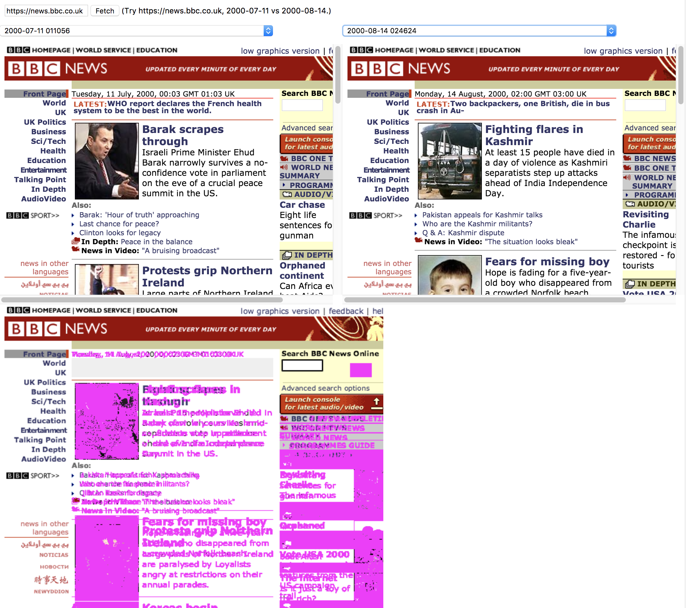

Chrome extension which lets you load a page at 2 different times and
image-diff them.

## Usage

Install this folder as an unpacked Chrome extension. Click the toolbar
button ("W") to open the entry page. Enter a URL, click Fetch, then
choose a left and right version.
